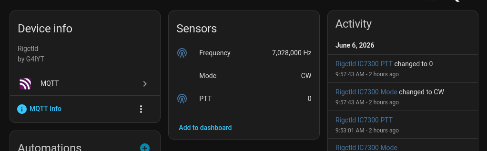

# `rigctld` to MQTT bridge

I wanted to do some Home Assistant Automation involving my radio gear and needed to know the current frequency/band and PTT state for my rigs. This project will regularly poll a `rigctld` instance and send the current state to an MQTT broker.

This is read only for now, I don't currently have a requirement to send commands from MQTT back to `rigctld` but have left the topic structure open so it may be added in the future.

## Installing

```
sudo make install # Drops binary to /usr/local/bin/rigctld-mqtt
```

Then create a systemd unit file. This is what I use for my IC7300, stored in `/etc/systemd/system/rigctld-ic7300.service`, alter to your taste:

```
[Unit]
Description=rigctld-mqtt (Icom 7300)
BindsTo=rigctld-ic7300.service
After=rigctld-ic7300.service

[Service]
ExecStart=/usr/local/bin/rigctld-mqtt
TimeoutStopSec=5
KillMode=mixed
Restart=always
RestartSec=3

Environment=RIGCTLD_ADDR=localhost:4532
Environment=MQTT_ADDR=localhost:1883
Environment=MQTT_USER=rigctld
Environment=MQTT_PASS=xxx
Environment=MQTT_TOPIC=rigctld/ic7300
Environment=MQTT_CLIENT_ID=rigctld-ic7300
Environment=POLL_INTERVAL=2s
Environment=HASS_DISCOVERY=1

[Install]
WantedBy=multi-user.target

```

Enable and start with `systemctl enable --now rigctld-mqtt-ic7300.service`.



## Configuration
All configuration is via environment variable. Available options are:

- `RIGCTLD_ADDR`: Specifies the address for `rigctld`, e.g. `localhost:4532`
- `MQTT_ADDR`: Address of MQTT server, e.g. `localhost:1883`
- `MQTT_USER`: MQTT username. Omit if not required.
- `MQTT_PASS`: MQTT password. Omit if not required.
- `MQTT_TOPIC`: Base topic to publish under
- `MQTT_CLIENT_ID`: Client ID for MQTT connection, omit if not required.
- `POLL_INTERVAL`: How often to poll `rigctld` for state. Defaults to `10s`
- `HASS_DISCOVERY`: Omit if not required. Set to any value to publish Home Assistant auto-discovery data. This makes your rigctl sensors appear automatically in Home Assistant.
- `HASS_NAME`: Set a custom name for the device in Home Assistant.
